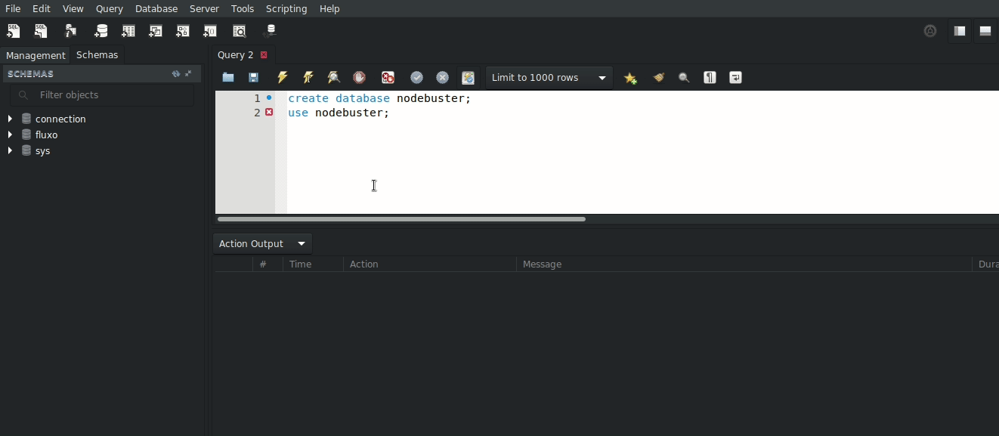
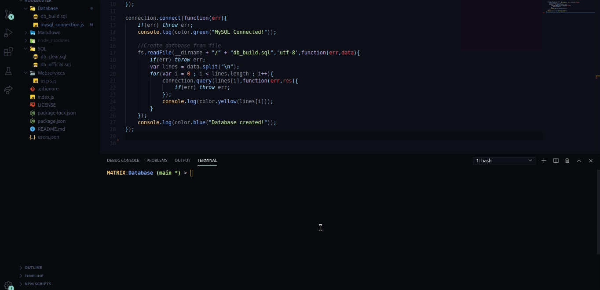

# Nodebuster

### Node Blockbuster

* [Issues Organization](https://github.com/F4NT0/Nodebuster/projects/1)
* [SQL file with Database](https://github.com/F4NT0/Nodebuster/blob/main/SQL/db_official.sql)

### Programs

* [Postman](https://www.postman.com/) to test de Requests.
* mysql module: `npm install mysql --save`
* express module: `npm install express --save`
* body-parser module: `npm install body-parser --save`
* cli-color module: `npm install cli-color --save`

### Database

* The Relational Database MySQL and his SQL file to create the tables and insertions is located in _Database/_ directory
* Created a Database on MySQL Workbench:

```sql
-- Inside MySQL Workbench Query
create database nodebuster;
use nodebuster;
```



* The file [*mysql_connection.js*](https://github.com/F4NT0/Nodebuster/blob/main/Database/mysql_connection.js) reads the file [*db_build.sql*](https://github.com/F4NT0/Nodebuster/blob/main/Database/db_build.sql) to Create and Insert data inside the Database:

* If you use Linux and have installed Node.js, use the following commands on Terminal:

```shell
cd Database && node mysql_connection.js
```



* The complete SQL file with documented information are in [*SQL/db_official.sql*](https://github.com/F4NT0/Nodebuster/blob/main/SQL/db_official.sql)

* After the Database was complete, you can test the Services using the command `npm test` on Terminal.
### Webservices

* All the HTTP Request was tested using Postman and the Collection created are Stored in the _Postman/_ Directory.

File|Info
|---|---|
**Nodebuster - Movie.postman_collection.json**| Tests from Movie table Webservice
