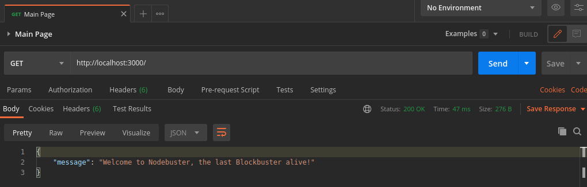
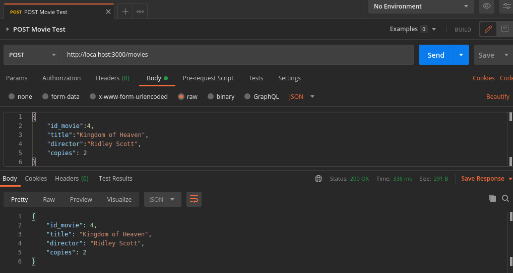
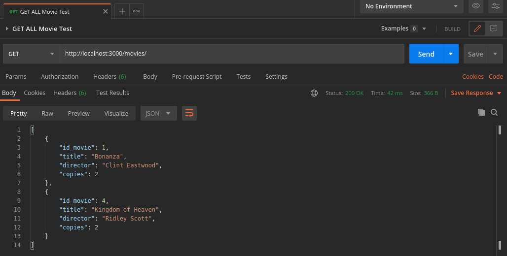
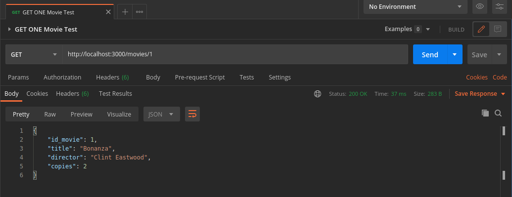
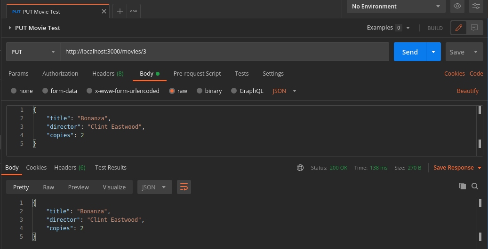
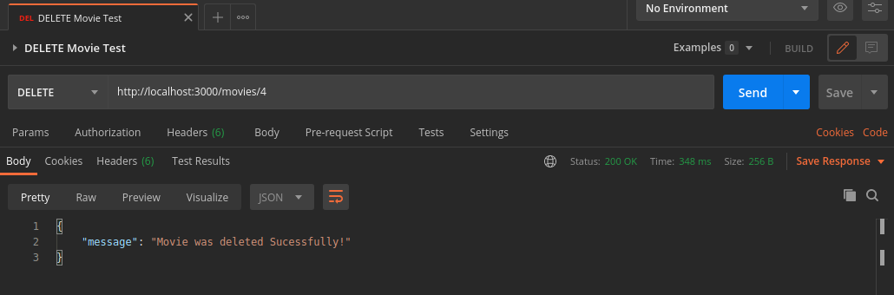
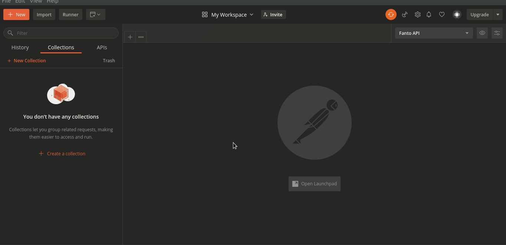

# Nodebuster

### Node Blockbuster

* [Issues Organization](https://github.com/F4NT0/Nodebuster/projects/1)
* [SQL file with Database](https://github.com/F4NT0/Nodebuster/blob/main/SQL/db_official.sql)

### Programs

* [Postman](https://www.postman.com/) to test de Requests.
* [Vscode](https://code.visualstudio.com/) to write and test the project.
* mysql module: `npm install mysql --save`
* express module: `npm install express --save`
* body-parser module: `npm install body-parser --save`
* cli-color module: `npm install cli-color --save`

### Database

* The Relational Database MySQL and his SQL file to create the tables and insertions is located in _Database/_ directory
* Created a Database on MySQL Workbench:

```sql
-- Inside MySQL Workbench Query
create database nodebuster;
use nodebuster;
```


* The file [*mysql_connection.js*](https://github.com/F4NT0/Nodebuster/blob/main/Database/mysql_connection.js) reads the file [*db_build.sql*](https://github.com/F4NT0/Nodebuster/blob/main/Database/db_build.sql) to Create and Insert data inside the Database:

* If you use Linux and have installed Node.js, use the following commands on Terminal:

```shell
cd Database && node mysql_connection.js
```


* The complete SQL file with documented information are in [*SQL/db_official.sql*](https://github.com/F4NT0/Nodebuster/blob/main/SQL/db_official.sql)

* After the Database was complete, you can test the Services using the command `npm test` on Terminal.

### Webservices

* All the HTTP Request was tested using Postman and the Collection created are Stored in the _Postman/_ Directory.

File|Info
|---|---|
**Nodebuster - Movie.postman_collection.json**| Tests from Movie Webservice
**Nodebuster - Client.postman_collection.json**| Tests from Client Webservice
**Nodebuster - Rent.postman_collection.json**| Tests from Rent Webservice

* To test the Requests, do the following:

1. Download e Open [Postman](https://www.postman.com/).
2. In the Upper Left side have the button _Import_, click and choose the Collection you want to test.
3. Run the Project using the command `npm test` on your terminal (Linux is better).
4. There's the following options to test, on each Collection:

---

* **Main Page** = it's a GET Request from Root page.

Request type|Link|Name on collection|
|---|---|---|
GET|http://localhost:3000/|Main Page|



---

* **POST Request** = POST create a new Movie for our Database, requesting a JSON
  * Write the JSON on the _Body_ tab, select _raw_, select _JSON_ on the right and put the Columns from the Table as JSON.
 
Request type|Link|Name on collection|
|---|---|---|
POST|http://localhost:3000/movies/|POST Movie Test|



---

* **GET ALL Request** = GET ALL takes all the data from the Database Table in a JSON format.
 
Request type|Link|Name on collection|
|---|---|---|
GET ALL|http://localhost:3000/movies/|GET ALL Movie Test|



---

* **GET ONE Request** = GET ONE takes only one info from database where it needs the ID from the data
 
Request type|Link|Name on collection|
|---|---|---|
GET ONE|http://localhost:3000/movies/id|GET ONE Movie Test|



---

* **PUT Request** = PUT update data from one information, where you need to insert the id for what data you want to change and create a JSON with the new infos you want to insert
    * Write the JSON on the _Body_ tab, select _raw_, select _JSON_ on the right and put the Columns from the Table as JSON.
 
Request type|Link|Name on collection|
|---|---|---|
PUT|http://localhost:3000/movies/id|PUT Movie Test|



---

* **DELETE Request** = DELETE remove a data for your Database, it need an id do delete (obs: be careful!)

Request type|Link|Name on collection|
|---|---|---|
DELETE|http://localhost:3000/movies/id|DELETE Movie Test|



---

**All the Collections for Postman are in that order and with this tests.**

#### Visual Apresentation

